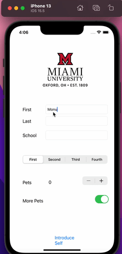

# StudentIntro
A simple app to read information from the UI.

- Improve the UI by using different fonts/colors/background
- Research persistence to learn how to store the information so when app reboots the informatoin remains
- Add more fields to crease a more thorough introduction

